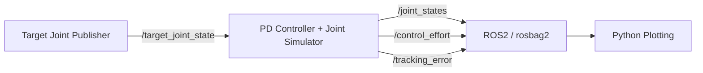

# ros2_robot_basics

A compact ROS2 control project demonstrating a complete robotics software loop:

**reference generation → ROS2 communication → feedback control → joint simulation → rosbag2 logging → data analysis**

The project intentionally uses a simple one-degree-of-freedom joint so that the control logic and ROS2 architecture remain easy to inspect.

## What this project demonstrates

- ROS2 publisher/subscriber communication with `rclpy`
- Desired and measured joint states using `sensor_msgs/JointState`
- Joint-space PD control
- A simple second-order joint dynamics model
- ROS2 launch files and YAML parameter configuration
- `rosbag2` data recording
- Python post-processing and tracking visualization

## Architecture



The controller and simulated plant are intentionally contained in one node in this first project. A later extension can separate the controller, hardware interface, and physics plant into independent components.

## Control model

The simulated joint follows:

```text
I * q_ddot + b * q_dot = tau
```

The PD controller is:

```text
tau = Kp * (q_des - q) + Kd * (qdot_des - qdot)
```

where:

- `q_des`: desired joint position
- `q`: actual joint position
- `qdot_des`: desired joint velocity
- `qdot`: actual joint velocity
- `Kp`: proportional gain
- `Kd`: derivative gain
- `tau`: commanded joint effort

The joint dynamics are integrated numerically with a semi-implicit Euler step.

## Repository structure

```text
ros2_robot_basics
├── publisher_node
│   └── target_joint_publisher.py
├── controller_node
│   └── joint_pd_simulator.py
├── launch
│   └── robot_basics.launch.py
├── config
│   └── controller.yaml
├── scripts
│   └── plot_from_bag.py
├── docs
├── resource
├── package.xml
├── setup.py
├── setup.cfg
└── README.md
```

## ROS2 topics

| Topic | Message type | Purpose |
|---|---|---|
| `/target_joint_state` | `sensor_msgs/JointState` | Desired joint angle and velocity |
| `/joint_states` | `sensor_msgs/JointState` | Simulated actual joint state |
| `/control_effort` | `std_msgs/Float64` | PD controller output |
| `/tracking_error` | `std_msgs/Float64` | Position tracking error |

## Requirements

Recommended environment:

- Ubuntu 22.04 + ROS2 Humble, or a newer ROS2 distribution
- Python 3
- `colcon`
- `rosbag2`
- `matplotlib`

Install common dependencies:

```bash
sudo apt update
sudo apt install python3-colcon-common-extensions python3-matplotlib
```

Source ROS2, for example:

```bash
source /opt/ros/humble/setup.bash
```

Replace `humble` with your ROS2 distribution when needed.

## Build

```bash
mkdir -p ~/ros2_ws/src
cd ~/ros2_ws/src
git clone https://github.com/ChanYanxin/ros2_robot_basics.git

cd ~/ros2_ws
colcon build --symlink-install
source install/setup.bash
```

## Run

Start the target publisher and PD simulator:

```bash
ros2 launch ros2_robot_basics robot_basics.launch.py
```

Inspect ROS2 communication:

```bash
ros2 topic list
ros2 topic echo /target_joint_state
ros2 topic echo /joint_states
```

## Record data with rosbag2

The launch file can start recording automatically:

```bash
ros2 launch ros2_robot_basics robot_basics.launch.py \
  record_bag:=true \
  bag_name:=rosbag2_joint_tracking
```

Or record manually:

```bash
ros2 bag record --storage sqlite3 \
  /target_joint_state \
  /joint_states \
  /control_effort \
  /tracking_error
```

Stop the experiment with `Ctrl+C`.

## Plot target vs. actual joint angle

From the repository root:

```bash
python3 scripts/plot_from_bag.py rosbag2_joint_tracking
```

The result is saved as:

```text
docs/joint_tracking.png
```

Once an experiment has been run, the result can be embedded here:

```markdown

```

## Controller parameters

Edit `config/controller.yaml`:

```yaml
kp: 25.0
kd: 7.0
inertia: 1.0
damping: 0.8
effort_limit: 20.0
```

A useful control experiment is to keep the same target trajectory and compare:

1. low `Kp`
2. high `Kp` with low `Kd`
3. well-damped `Kp` / `Kd`

Then compare tracking error, overshoot, settling behavior, and control effort.

## Suggested portfolio demo

A 60–90 second demo can show:

1. building the package with `colcon`
2. starting both nodes with `ros2 launch`
3. inspecting `/target_joint_state` and `/joint_states`
4. recording the experiment with rosbag2
5. generating the target-vs-actual tracking plot

## Known limitations

This is deliberately a minimal educational simulator:

- only one revolute joint is modeled
- the plant contains only inertia and viscous damping
- no gravity, Coulomb friction, encoder noise, delay, or actuator dynamics
- controller and plant currently run in the same node
- this is not a replacement for `ros2_control` or a physics simulator

These limitations keep the control loop transparent and provide a clear path for extension.

## Next steps

Natural extensions are:

- separate controller and plant nodes
- add gravity and Coulomb friction
- migrate the controller to `ros2_control`
- add multi-DOF trajectory generation
- simulate a Franka Panda or UR5 in Gazebo or MuJoCo
- compare joint-space PD, computed-torque, and Cartesian impedance control

This repository is intended to be the foundation for a larger robotics-control portfolio.

## License

MIT
